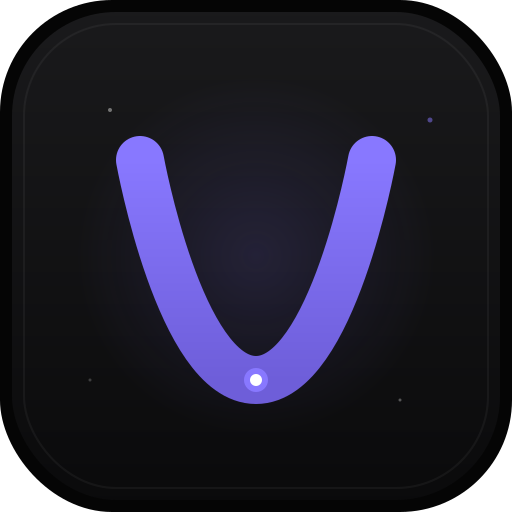

# VoidGuide 🌌

VoidGuide is a high-performance, AI-native desktop application designed for seamless codebase exploration and modification. Built with a focus on "Glass" aesthetics and developer velocity, it bridges the gap between raw AI potential and practical filesystem operations.

<p align="center">
  
</p>

## 📥 Downloads

You can download the latest pre-built binaries from the [Releases](https://github.com/shridhargsabat/voidguide-binaries/releases) page.

### Installation Guide

#### 🪟 Windows
1. Download the `VoidGuide Setup 1.1.1.exe` installer from the latest release.
2. Run the installer and follow the on-screen instructions.
3. Launch **VoidGuide** from your Start Menu.

#### 🐧 Linux
VoidGuide provides multiple package formats for Linux:
- **AppImage**: Download the `.AppImage` file, make it executable (`chmod +x`), and run it.
- **Debian/Ubuntu**: Download the `.deb` package and install it using `sudo apt install ./voidguide.deb`.
- **Fedora/RHEL**: Download the `.rpm` package and install it using `sudo dnf install ./voidguide.rpm`.

#### 🍎 macOS
1. Download the `.zip` archive from the latest release.
2. Extract the archive.
3. Drag and drop `VoidGuide.app` into your **Applications** folder.

### Reinstalling / Upgrading

If you already have VoidGuide installed and need to reinstall or upgrade:

#### 🪟 Windows
Re-run the installer - it will automatically upgrade.

#### 🐧 Linux (Fedora/RHEL)
```bash
curl -L -o /tmp/voidguide.rpm "https://github.com/shridhargsabat/voidguide-binaries/releases/download/v1.1.1/voidguide-1.1.1.x86_64.rpm"
sudo dnf reinstall -y /tmp/voidguide.rpm
```

#### 🐧 Linux (Ubuntu/Debian)
```bash
curl -L -o /tmp/voidguide.deb "https://github.com/shridhargsabat/voidguide-binaries/releases/download/v1.1.1/voidguide_1.1.1_amd64.deb"
sudo dpkg -i /tmp/voidguide.deb
```

#### 🍎 macOS
Re-download the `.zip` and replace the existing app in Applications.

---

## 🚀 Key Features

- **AI-Native Workflow**: Deep integration with leading AI providers (Google, Anthropic, OpenAI, OpenRouter, Groq, Mistral, DeepSeek, Perplexity, Cohere) for intelligent file reading, searching, and writing.
- **Advanced Model Support**: Full support for **Gemma 4 31B** and Claude 3.5 Sonnet, with native thinking/reasoning extraction.
- **HITL (Human-In-The-Loop) Approval**: Mandatory, high-fidelity approval flow for all filesystem modifications with syntax-highlighted diffs.
- **Visual Agentic Reasoning**: Real-time transparency into the AI's "thought process" via animated reasoning overlays.
- **Zen Startup**: Application launches in a clean, sidebar-less "Zen" mode by default to maximize focus.
- **Glass Aesthetic**: A modern, translucent UI with **34 distinct "Glass" themes** (Dark, Light, Void, Midnight, etc.) and smooth animations.
- **Dynamic Typography**: Theme-aware font pairings (e.g., Poppins, IBM Plex) that adapt instantly when switching themes.
- **High-Performance Search**: Optimized Command Palette (⌘K) with zero-lag interaction.
- **Multi-Session Management**: Robust state persistence with recency-based sorting and automatic session titling.
- **Integrated Terminal**: Native shell access within the app using xterm.js.
- **Smart File Indexing**: Real-time workspace scanning with a highly responsive file tree.
- **Multi-Agent System**: Specialized agents (Coder, Architect, Investigator) with distinct visual tagging.
- **Free Web Research**: Native, 100% free web search capability using a parallel-racing engine (SearXNG + DuckDuckGo).
- **Sophisticated Motion System**: Entirely rebuilt using **Framer Motion**, featuring spring-based physics for all interactions.
- **Keyboard-Centric**: Fast navigation via Command Palette (⌘K), inline chat slash commands (`/`), and file mentions (`@`).
- **Dynamic Version Tracking**: Real-time application version display on the startup splash screen and status bar.
- **Integrated Changelog**: Easily access version history and release notes directly via the Status Bar or Command Palette.

---

## 🛡 Security & Stability
All binaries are built using a secure CI/CD pipeline. For security and intellectual property reasons, this repository only contains compiled artifacts; the source code is maintained in a private repository.

---
*Built with ❤️ by [Shridhar Sabat](mailto:shridhargsabat@gmail.com) for the next generation of software engineers.*
